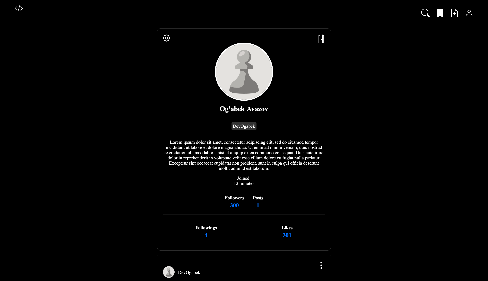

# Django Social Media Application

Welcome to my Django Social Media Platform! Connect with others, share content, and explore exciting features.

[](https://djangosocialmediaapplication.pythonanywhere.com/users/profile/1/)

## Live Demo
Check out the live demo: [Social Media Platform Demo](https://djangosocialmediaapplication.pythonanywhere.com)

## Features

- **Authentication**: Securely sign up, sign in, and reset passwords.
- **Profiles**: Explore, view, edit, and delete user profiles.
- **Posting**: Create, edit, and delete posts. Attach images for a rich experience.
- **Comments**: Engage with posts through comments.
- **Likes**: Express your appreciation by liking posts and comments.
- **Saves**: Easily find the posts you need by saving posts
- **Follow/Unfollow**: Stay updated with others' posts.
- **Search**: Easily find users.
- **Email Verification**: Ensure account security.

> [!IMPORTANT]
> If you're unable to log in, make sure to enter your email information in the .env file.

## Repository

Explore the source code and contribute to the development on GitHub:

[](https://github.com/DevOgabek/DjangoSocialMediaApplication)

## Installation

Follow these steps to set up the Social Media Platform on your local machine:

1. **Clone the repository**:

   ```bash
   git clone https://github.com/DevOgabek/DjangoSocialMediaApplication.git
   ```

2. **Install dependencies**:

   ```bash
   pip install -r requirements.txt
   ```

3. **Set up environment variables**:
   - Create a `.env` file in the root directory.
   - Define the following environment variables:
     - `EMAIL`: Your Gmail email address for sending verification emails.
     - `PASSWORD`: Your Gmail password or an application-specific password for sending emails.

4. **Apply database migrations**:

   ```bash
   python manage.py migrate
   ```

5. **Run the development server**:

   ```bash
   python manage.py runserver
   ```

After completing these steps, you'll have the Social Media Platform up and running locally. Access it via your web browser at `http://localhost:8000`.

## Usage

1. **Sign Up / Sign In**: Create an account or sign in.
2. **Profile Management**: Customize profile settings.
3. **Posting Content**: Share thoughts and multimedia.
4. **Interacting with Content**: Like, comment, and share.
5. **Discovering Content**: Find users and explore posts.
6. **Account Settings**: Manage security and privacy.

## Contributing

Contributions welcome! Open issues or submit pull requests.

> [!IMPORTANT]
> When creating an account, ensure you enter a valid email address. You'll need to confirm it when logging in.

## License

This project is licensed under the MIT License - see the [LICENSE](LICENSE) file for details.


> [!IMPORTANT]
> If you're unable to log in, make sure to enter your email information in the .env file. Also, feel free to explore the source code and contribute to the development on [GitHub](https://github.com/DevOgabek/DjangoSocialMediaApplication).
